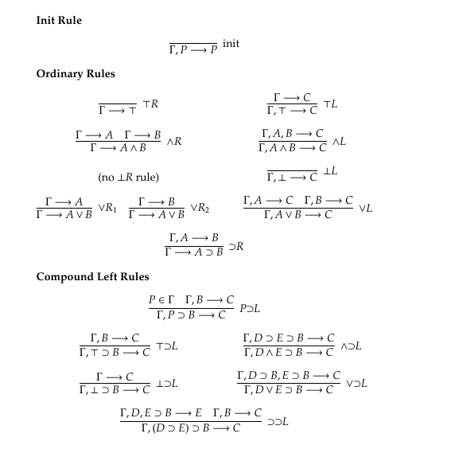

# G4ip

## Description

Implementation of a theorem prover for intuitionistic propositional logic using G4ip in Haskell.

Fork of [cacay/G4ip](https://github.com/cacay/G4ip/).

### G4ip rules



## Improvements over the original code

* proof trees are now constructing explicitly
* added proposition parser
* added exporting of the proof tree to LaTeX

## File Structure

* G4ipProver/Proposition.hs   -- Definition of propositions and some syntactic sugar
* G4ipProver/Prover.hs        -- The actual theorem prover
* G4ipProver/Parser.hs        -- Parser for propositions
* G4ipProver/LaTeXExporter.hs -- Exporter for proofs
* G4ipProver.hs               -- Re-exports the above module
* Main.hs                     -- g4ip-prover binary

## Running

Use [stack](http://haskellstack.org/): `stack exec g4ip-prover`

## Usage

```
g4ip-prover [OPTIONS] PROPOSITION
g4ip-prover [OPTIONS]
```

If the proposition was not specified, the user will be prompted to enter it interactively.

### Options

```
--proof-header <file>       Template header file for proof.
                            Default value: static/proof-header.txt
--proof-footer <file>       Template footer file for proof.
                            Default value: static/proof-footer.txt
--context-header <file>     Template header file for context.
                            Default value: static/context-header.txt
--context-footer <file>     Template footer file for context.
                            Default value: static/context-footer.txt
--proof-file <file>         Proof file name. If the file exists, it will be overwritten.
                            Default value: output/proof.tex
--context-file <file>       Context file name. If the file exists, it will be overwritten.
                            Default value: output/context.tex
```

### Proposition syntax

```
Variables must consist of lower-case english characters and numbers.
Propositional connectives (with precedence level):
   ~ , -    - negation, 1
   /\, &    - conjunction, 2
   \/, |    - disjunction, 3
   ->, =>   - implication, 4
   <-, <=   - implication, 4
   <->, <=> - equivalency, 5
Logical constants:
   T - True
   F - False
```

### Converting to PDF

Use [bussproofs](http://math.ucsd.edu/~sbuss/ResearchWeb/bussproofs/) and [pdflatex](https://www.tug.org/applications/pdftex/).